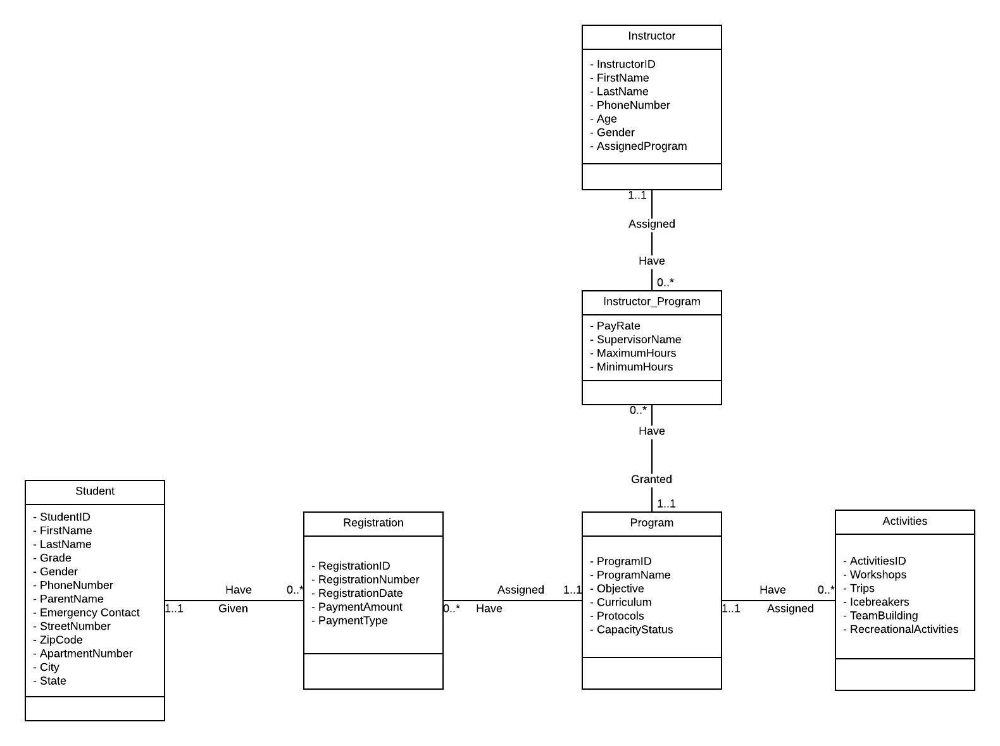

# Business Description
  Our summer camp primarily caters toward children from grades kindergarten to fifth
grade recently considered switching from using spreadsheets to a database management system.
The exponential increase in admissions to our summer camp program has led us to sought
efficient methods to organize important information. We have been using spreadsheets to record
our students, camp capacity, programs, program activities and program instructor. As an
alternative of our manual method, we would like to be in favor of a scalable database.

  With a database, Students enrolls in one of the many Programs our summer camp offers.
The Program must include the following: program name, enrollment count, objective,
curriculum, protocols. With every Program, there is a leading Instructor whose information must
be recorded such as name, gender, age, phone number, program assigned, and et cetera. Before a
Student enrolls into a Program, they are able to see the Activities included into the Program.
These activities may be trips, workshops, recreational activities, group exercises.

  Among our Instructors, we must keep track of their pay rate, maximum and minimum
number of hours required to work, and their supervisor. This is critical to properly conduct
payroll for each and every one of our instructors.

# Entity Relationship Diagram

# Relational Model Breakdown:
Student ( **StudentID(KEY)** , FirstName, LastName, Grade, Gender, PhoneNumber, ParentName,
EmergencyContact, StreetNumber, City, State, Zipcode, ApartmentNumber)

Registration ( **RegistrationID(KEY)** , RegistrationNumber, RegistrationDate, PaymentAmount,
PaymentType, **StudentID(KEY) , ProgramID(KEY)** )

Program ( **ProgramID(KEY)** , ProgramName, Objective, Curriculum, Protocols, CapacityStatus)

Activities ( **ActivitiesID(KEY)** , Workshops, Trips, Icebreakers, Teambuilding,
RecreationalActivities, **ProgramID(KEY)** )

Instructor ( **InstructorID(KEY)** , FirstName, LastName, PhoneNumber, Age, Gender,
AssignedProgram)

Instructor_Program ( **InstructorID(KEY), ProgramID(KEY)** , PayRate, SupervisorName,
MaximumHours, MinimumHours)

# Authors
Isaiah Hong,
Nicholas Yom,
Artem Zinkin,
Tofajjal Mirza
